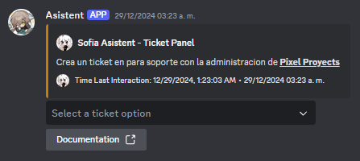

# Economía

Un sistema que implementa un sistema económico, lo que permite a los propietarios de servidores crear una moneda virtual para su comunidad. El bot realiza un seguimiento del saldo de cada usuario y les permite ganar y gastar la moneda a través de una variedad de comandos.

El proyecto ofrece varias opciones de personalización, como ajustar la tasa a la que los usuarios pueden ganar moneda y configurar artículos personalizados para comprar con la moneda virtual.

## Comandos

| Comandos                       | Descripcion                                  |
| ------------------------------ | -------------------------------------------- |
| /balance \<user>               | retorna la información economica del usuario |
| /inventario \<ver> \<user>     | ve los items dentro del perfil del usuario   |
| /inventario user\_item \<item> | obtén los beneficios del item que compraste  |
| /pay \<user> \<amount>         | paga a un usuario una cantidad seleccionada  |

configuracion de la tienda

| Comandos           | Descripcion                                   |
| ------------------ | --------------------------------------------- |
| /tienda \<añadir>  | agrega un nuevo item a la tienda del servidor |
| /tienda \<ver>     | ve los items actuales de la tienda            |
| /tienda \<comprar> | compra algun item de la tienda                |
| /tienda \<remove>  | elimina algun item dentro de la tienda        |

## Ejemplos

<figure><figcaption>
sistema de economía
</figcaption></figure>

<figure><figcaption>
sistema de economia
</figcaption></figure>
